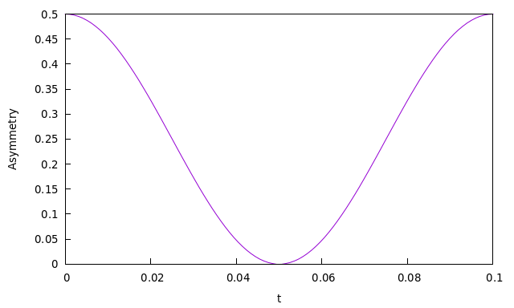
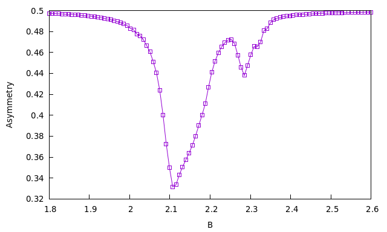

# Examples
Here we go over a few examples of usage of MuSpinSim which cover some common use cases. The examples can be found in the `./examples` folder.

## Example 1 - Hyperfine coupling
**Input file:** `./examples/hfine/hfine.in`

A very simple case: a muon and an electron with hyperfine coupling and zero magnetic field. The hyperfine tensor is set to have an isotropic component (Fermi contact term) of 10 MHz:

```plaintext
hyperfine 1
    10   0    0
    0    10   0
    0    0    10
```

so we expect an oscillation of the muon's polarisation at that frequency.



## Example 2 - Hyperfine coupling (with powder averaging)
**Input file:** `./examples/hfine_powder/hfine_powder.in`

A similar example as the first, but this time, an anisotropic hyperfine tensor including a dipolar part is used:

```plaintext
hyperfine 1
    5    2    3
    2    5    2
    3    2    5
```

In addition, a full averaging over 1,000 solid angles is carried out:

```plaintext
orientation
    eulrange(10)
```

Each of these orientations will contribute an oscillation like the one above with a slightly different frequency. The overall sum of all contributions ends up decaying due to the dephased individual oscillations cancelling out.


### Example 3 - Avoided Level Crossing
**Input file:** `./examples/alc/alc.in`

A simple example of an Avoided Level Crossing experiment involving three spins: a muon, an electron, and a hydrogen atom. Both muon and hydrogen are coupled via hyperfine coupling to the electron. The tensors are orientation dependent, and an average is carried out over different orientations (because this is an experiment with longitudinal polarisation, the `zcw` averaging should be sufficient, and is much cheaper than `eulrange`). The result can be seen as one major $\Delta_1$ peak around 2.1 T and a much smaller $\Delta_0$ one at 2.3 T.

